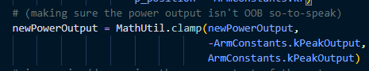
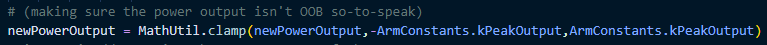
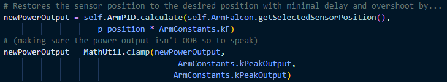
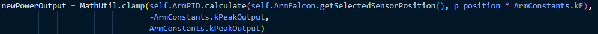

# 2024Robotpy
This is the FRC 6695 Robot code for the 2024 competitions season.

## Coding Standards
- Spacing set to tab size 4
- Single spaces inbetween conditional statments or mathematical operations
    - Yes `x > y`, `x * y`
    - No `x>y`, `x*y`
- Functions or if statements with multple parameters: put each parameter on a new line
  - Good Example: 
  - Bad Example: 
- Classes, funtions, and variables should have a description (using `""" """` under the declaration) which accurately describes their purpose
- Comments. For. Everthing. You might think your code painfully obvious to understand, but people new to club would have a significantly easier time if it was explained in words
- Keep nesting if statements to a minimum
- There is nothing from stopping you, so you have to make sure never to edit constants. There is no const, static, or final in python.
- Every class, function, and operation should have on function.
  - Good Example: 
  - Bad Example: 
### Naming Schema:
- Variables: camelCase
    - `m_` prefix for measurements
    - `p_` prefix for positions
    - `k` prefix for (???)
- Functions: camelCase
- Classes: PascalCase